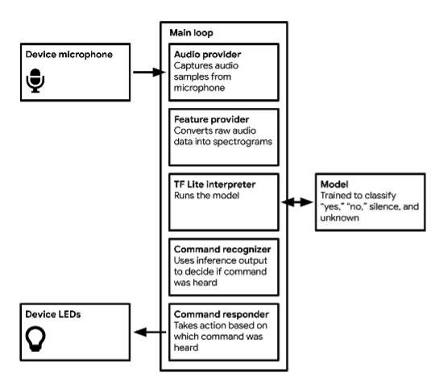
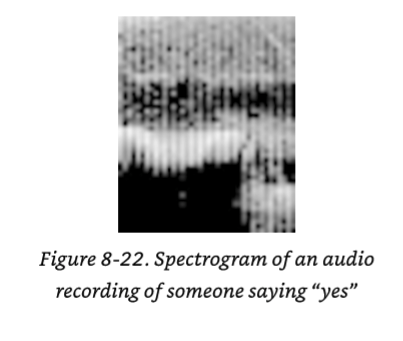
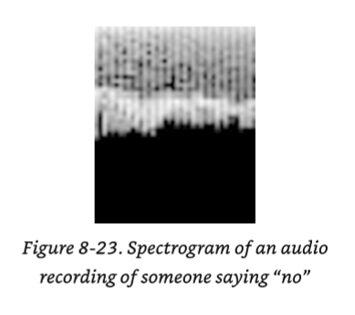

## Exercise 2: Micro_Speech



Image from [TinyML](https://www.oreilly.com/library/view/tinyml/9781492052036/)

1. Open the Arduino IDE
2. Select File -> Examples -> Arduino_TensorFlow Lite -> micro_speech
3. Review the source
    1. Specifically `micro_speech.ino` - where the model is loaded
    2. The `arduino_audio_provider.cpp` - where the samples are captured
    3. The `arduino_command_responder.cpp` - responses are handled to the commands inference. See what has been commented out by me in our source code in this project
    3. The `micro_features_model_settings.h` - features are set based on the FFT settings during training
4. Understand how the segmentation and length of samples can dictate the accuracy.
5. Install
    1. Double press the button the board to put it into bootloader mode.
    2. Ensure the light is pulsing.
    3. You now can now select the arrow to "upload" to the board.
    4. Once it's complete press the button on the board to reset.
6. Output
    1. Test inout by saying "yes", "no" and other words.
    1. Review the serial monitor.

### Turn Off Light By Saying No

Next, let's try a quick update to the code to have the light turn off by saying "no".

Change the code so that the response of `found_command` would perform a different action. Hint: Look in arduino_command_responder.cpp. For example, something like:

```
if (found_command[0] == 'o' && found_command[1] == 'n') {
    // turn the light on
```

### Training Model

If you are curious on how the audio is trained for this example, you can load, read and run the Jupyter Notebook from the source code:

[https://github.com/justingrammens/machine_learning/blob/master/tensorflow/lite/micro/examples/micro_speech/train/train_micro_speech_model.ipynb](https://github.com/justingrammens/machine_learning/blob/master/tensorflow/lite/micro/examples/micro_speech/train/train_micro_speech_model.ipynb)

* Note the data that is loaded for the training comes from the [Speech Command Dataset](https://ai.googleblog.com/2017/08/launching-speech-commands-dataset.html)
* It's also cool to see when you run the train.py script all of the various .wav fiels that are loaded into the `/content/dataset` directory in the virtual environment


In this test you can find the data that is mocked out for [YES](https://github.com/tensorflow/tflite-micro/blob/main/tensorflow/lite/micro/examples/micro_speech/micro_features/yes_micro_features_data.cc) and [NO](https://github.com/tensorflow/tflite-micro/blob/main/tensorflow/lite/micro/examples/micro_speech/micro_features/no_micro_features_data.cc)




Images from [TinyML](https://www.oreilly.com/library/view/tinyml/9781492052036/)

When it comes to training, the spectrogram images are much more consistent and contain all the characteristics you need of sound. There's a [really good article on these concepts](https://www.altexsoft.com/blog/audio-analysis/) that I encourage you to read.


### Tests

If you wish to return to your docker instance and be complete, you can run the tests for the audio, which compares the spectrogram created from a .wav audio file with the output of the.

`make -f tensorflow/lite/micro/tools/make/Makefile test_micro_speech_test`

A quick link to the source of the test file for micro_speech is:
 [https://github.com/tensorflow/tflite-micro/blob/main/tensorflow/lite/micro/examples/micro_speech/micro_speech_test.cc](https://github.com/tensorflow/tflite-micro/blob/main/tensorflow/lite/micro/examples/micro_speech/micro_speech_test.cc)
