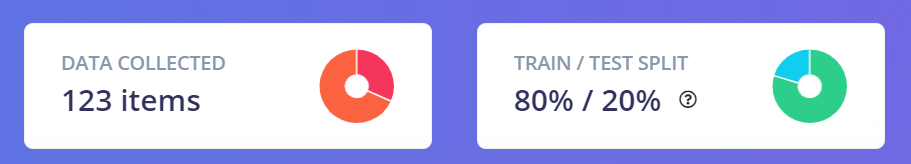
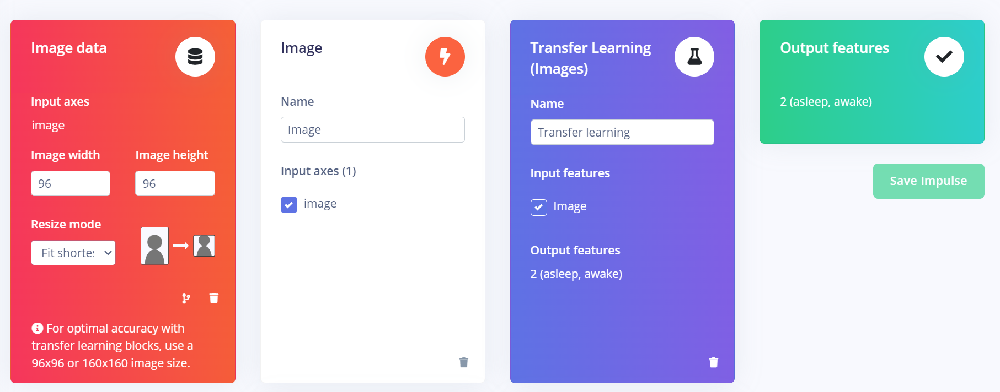
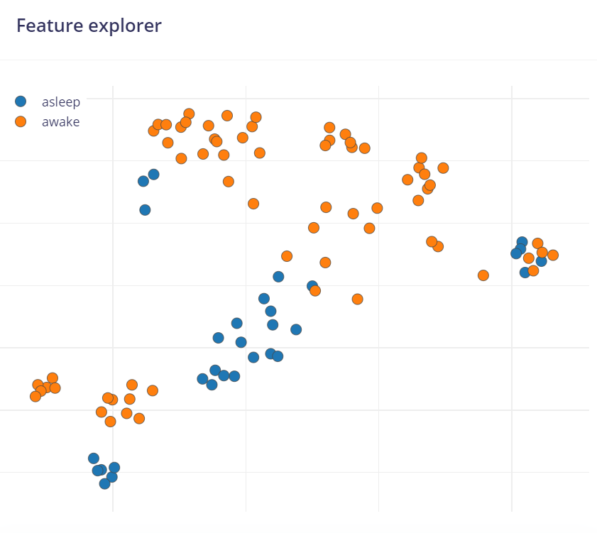
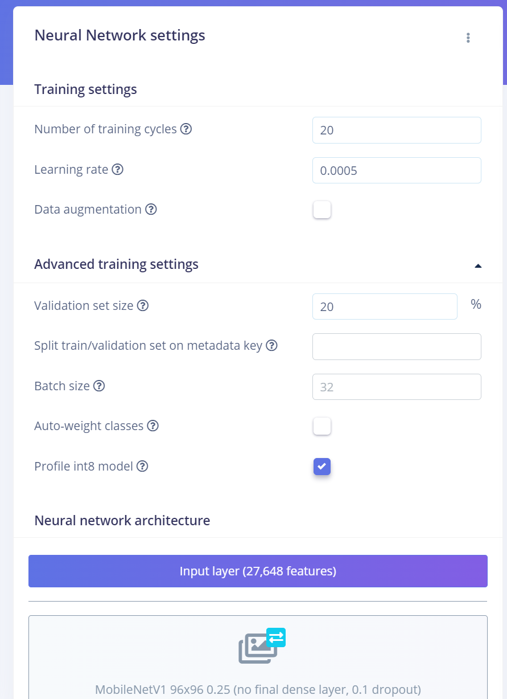
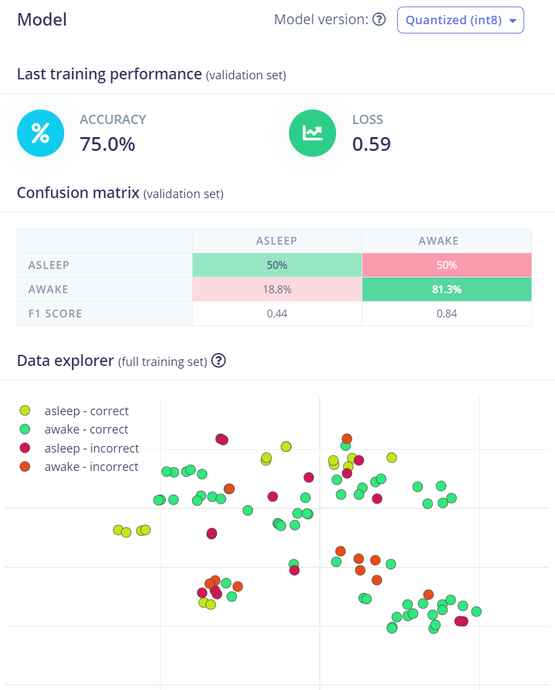
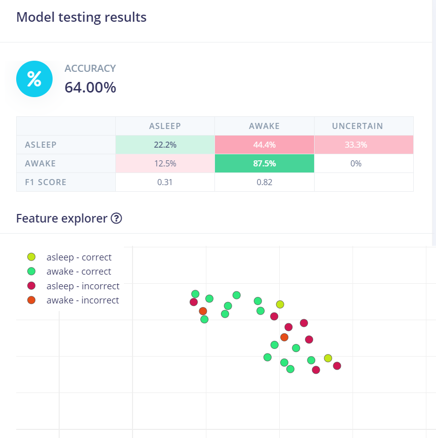
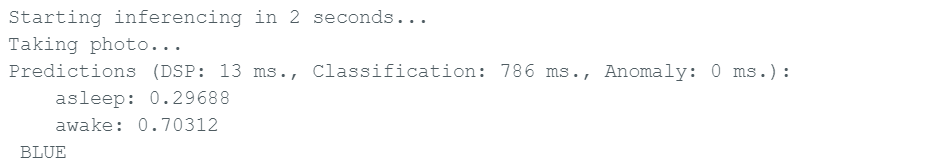
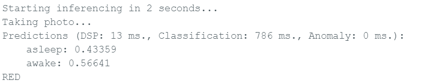

# Driver Sleep Awake Image Classification

This project is built on the [Adding Sight to Your Sensors](https://docs.edgeimpulse.com/docs/tutorials/end-to-end-tutorials/image-classification) tutorial on Edge Impulse.

In this project, we use machine learning to build a system that can recognize asleep and awake peaople in front of a camera. This is using and image classification model connected to the microcontroller [Arduino Nano 33 BLE Sense](https://store-usa.arduino.cc/products/arduino-nano-33-ble-sense). In this project, we collect images for a well-balanced dataset of asleep and awake people, apply transfer learning to train a neural network, and deploy the system to the Arduino embedded device. 

## Goal: 

If Arduino detects a person is awake (probaility[awake] >= 70%) it shows a blue Light and if the person is asleep it shows red light (probaility[awake] < 70%).

## Prerequisites

Refer to this page for prerequistes to use EI with Arduino Ble Sense 33: https://docs.edgeimpulse.com/docs/development-platforms/officially-supported-mcu-targets/arduino-nano-33-ble-sense

## Dataset

The dataset consist of:
* 123 images of people asleep and awake
* some are in th car, some in crowded areas and some in front of a blank background
* the dataset is gathered from [Roboflow](https://universe.roboflow.com/ml-k9qjo/driver-sleep-awake/dataset/6) and Google Images

## Data Split

The data is split:
* 80% training -> (80% tarinig and 20% validation)
* 20% testing

## Designing the Impulse

## Generating the Features

## Neural Network settings

### Model type

#### MobileNetV1 96x96 0.25

A pre-trained multi-layer convolutional network designed to efficiently classify images. Uses around 105.9K RAM and 301.6K ROM with default settings and optimizations.

## Edge Impulse - Training Output

## Edge Impulse - Test Output

## Arduino Output:

### Awake:

### Asleep / Not awake:

