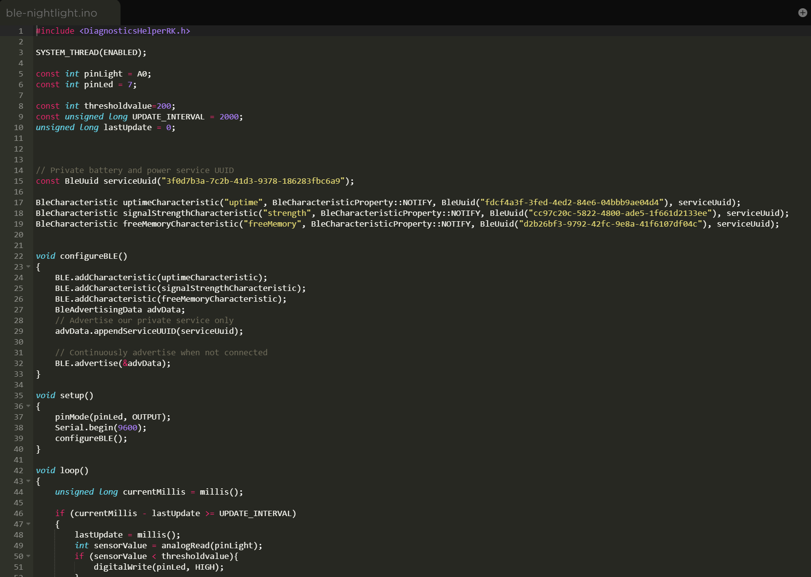
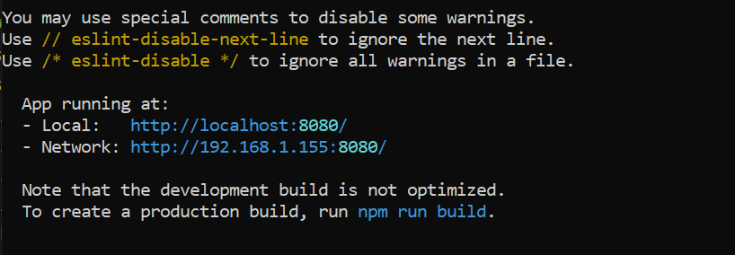
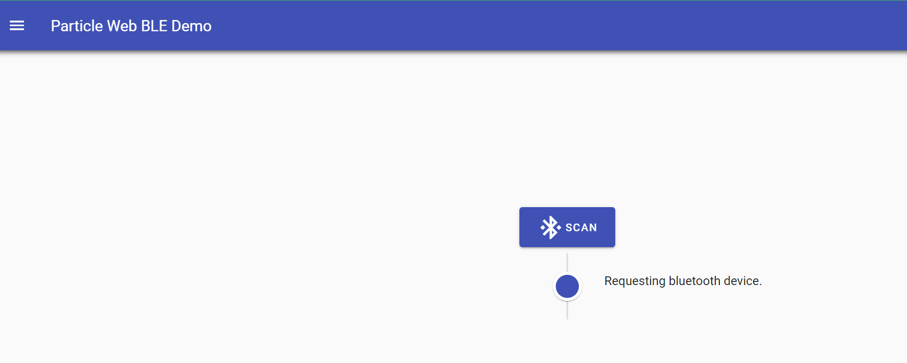

## Using BLE with the Night Light Project

In this lab, we explore using BLE to advertise data from your device. Specifically, using the BLE to advertise the uptime, Wi-Fi signal strength, and free memory on your device, which we'll then read from a browser using Web BLE and Chrome.

## UUID Generator:
https://www.uuidgenerator.net/

### Code:

### BLE Scan:

## Resource:

Note: This project is no longer maintained and is provided for historical reference only
https://docs.particle.io/community/particle-101-workshop/ble/

