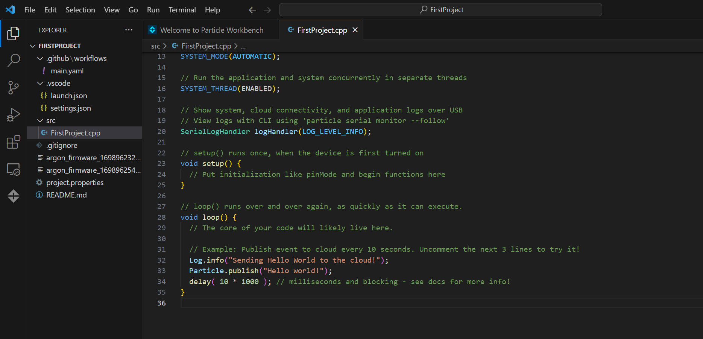

# FirstProject

This firmware project and Readme file were created using [Particle Developer Tools](https://www.particle.io/developer-tools/)




## Table of Contents
- [Introduction](#introduction)
- [Prerequisites To Use This Template](#prerequisites-to-use-this-repository)
- [Getting Started](#getting-started)
- [Particle Firmware At A Glance](#particle-firmware-at-a-glance)
  - [Logging](#logging)
  - [Setup and Loop](#setup-and-loop)
  - [Delays and Timing](#delays-and-timing)
  - [Testing and Debugging](#testing-and-debugging)
  - [GitHub Actions (CI/CD)](#github-actions-cicd)
  - [OTA](#ota)
- [Support and Feedback](#support-and-feedback)
- [Version](#version)

## Introduction

For an in-depth understanding of this project template, please refer to the [documentation](https://docs.particle.io/firmware/best-practices/firmware-template/).

## Prerequisites To Use This Repository

To use this software/firmware on a device, you'll need:

- A [Particle Device](https://www.particle.io/devices/).
- Windows/Mac/Linux for building the software and flashing it to a device.
- [Particle Development Tools](https://docs.particle.io/getting-started/developer-tools/developer-tools/) installed and set up on your computer.
- Optionally, a nice cup of tea (and perhaps a biscuit).

## Getting Started

1. While not essential, we recommend running the [device setup process](https://setup.particle.io/) on your Particle device first. This ensures your device's firmware is up-to-date and you have a solid baseline to start from.

2. If you haven't already, open this project in Visual Studio Code (File -> Open Folder). Then [compile and flash](https://docs.particle.io/getting-started/developer-tools/workbench/#cloud-build-and-flash) your device. Ensure your device's USB port is connected to your computer.

3. Verify the device's operation by monitoring its logging output:
    - In Visual Studio Code with the Particle Plugin, open the [command palette](https://docs.particle.io/getting-started/developer-tools/workbench/#particle-commands) and choose "Particle: Serial Monitor".
    - Or, using the Particle CLI, execute:
    ```
    particle serial monitor --follow
    ```

4. Uncomment the code at the bottom of the cpp file in your src directory to publish to the Particle Cloud! Login to console.particle.io to view your devices events in real time.

5. Customize this project! For firmware details, see [Particle firmware](https://docs.particle.io/reference/device-os/api/introduction/getting-started/). For information on the project's directory structure, visit [this link](https://docs.particle.io/firmware/best-practices/firmware-template/#project-overview).

## Particle Firmware At A Glance

### Logging

The firmware includes a [logging library](https://docs.particle.io/reference/device-os/api/logging/logger-class/). You can display messages at different levels and filter them:

```
Log.trace("This is trace message");
Log.info("This is info message");
Log.warn("This is warn message");
Log.error("This is error message");
```

### Setup and Loop

Particle projects originate from the Wiring/Processing framework, which is based on C++. Typically, one-time setup functions are placed in `setup()`, and the main application runs from the `loop()` function.

For advanced scenarios, explore our [threading support](https://docs.particle.io/firmware/software-design/threading-explainer/).

### Delays and Timing

By default, the setup() and loop() functions are blocking whilst they run, meaning that if you put in a delay, your entire application will wait for that delay to finish before anything else can run. 

For techniques that allow you to run multiple tasks in parallel without creating threads, checkout the code example [here](https://docs.particle.io/firmware/best-practices/firmware-template/).

(Note: Although using `delay()` isn't recommended for best practices, it's acceptable for testing.)

### Testing and Debugging

For firmware testing and debugging guidance, check [this documentation](https://docs.particle.io/troubleshooting/guides/build-tools-troubleshooting/debugging-firmware-builds/).

### GitHub Actions (CI/CD)

This project provides a YAML file for GitHub, automating firmware compilation whenever changes are pushed. More details on [Particle GitHub Actions](https://docs.particle.io/firmware/best-practices/github-actions/) are available.

### OTA

To learn how to utilize Particle's OTA service for device updates, consult [this documentation](https://docs.particle.io/getting-started/cloud/ota-updates/).

Test OTA with the 'Particle: Cloud Flash' command in Visual Studio Code or the CLI command 'particle flash'!

This firmware supports binary assets in OTA packages, allowing the inclusion of audio, images, configurations, and external microcontroller firmware. More details are [here](https://docs.particle.io/reference/device-os/api/asset-ota/asset-ota/).
