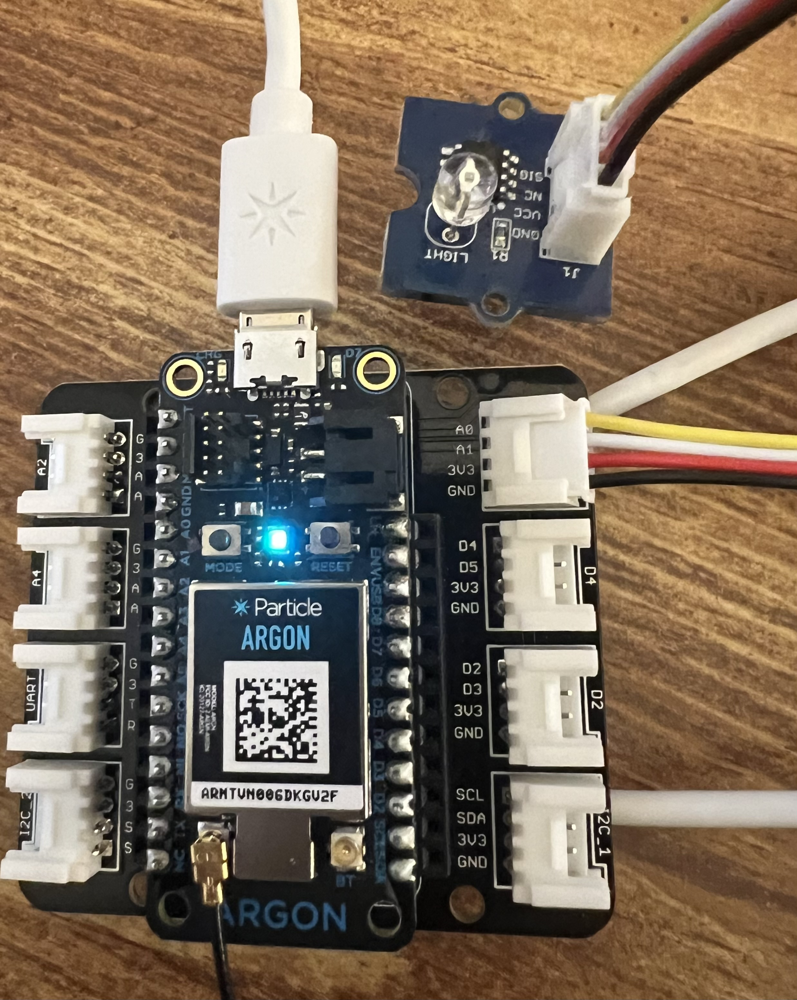
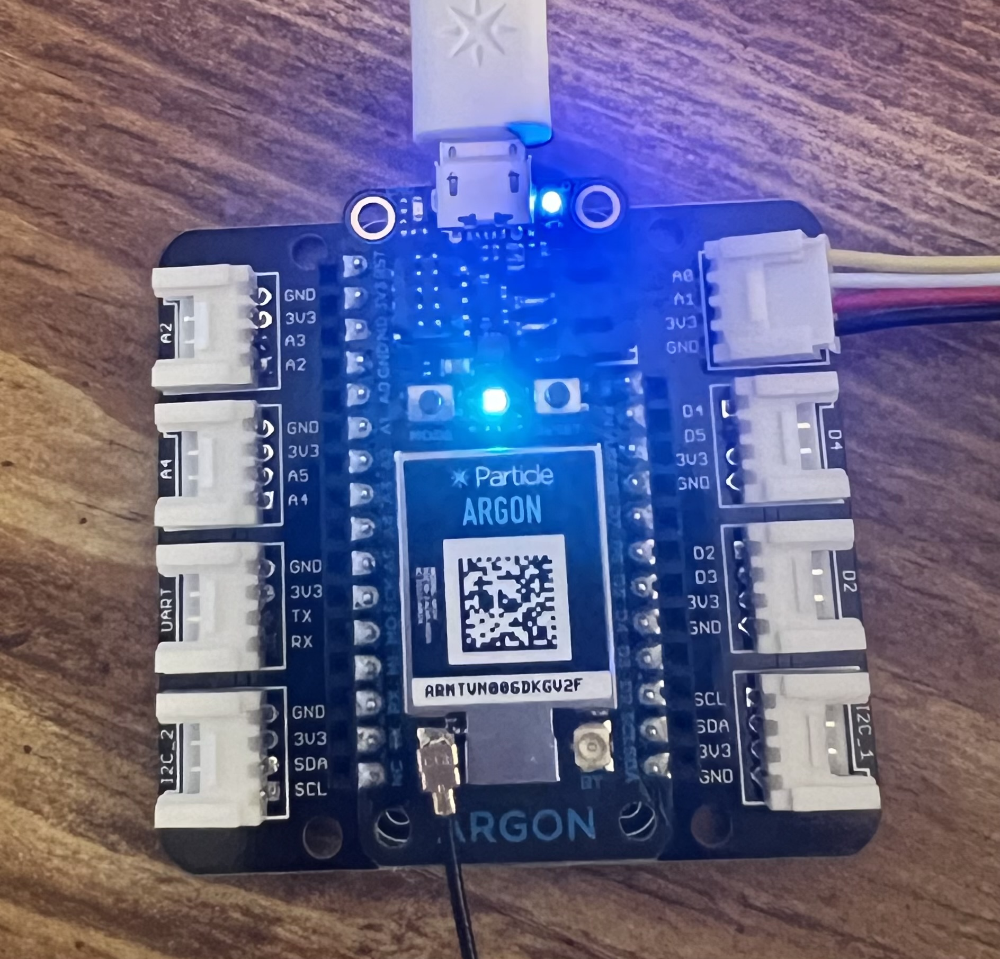

## Night Light

In this project we use the light sensor to register the amount of light. When it gets dark, the led on D7 emmits light.

## With the light sensor detecting light:

## With the light sensor covered and not detecting light:

