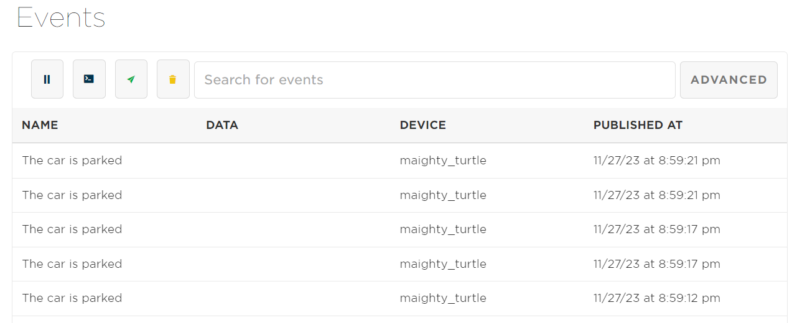

## Parking Sensor

## In this project when the distance registered is < 4 inches: 

(1) The red LED light turns on
(2) An event with the message "The car is parked" is published as a Particle Event

