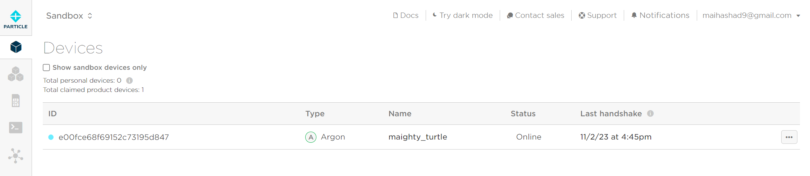
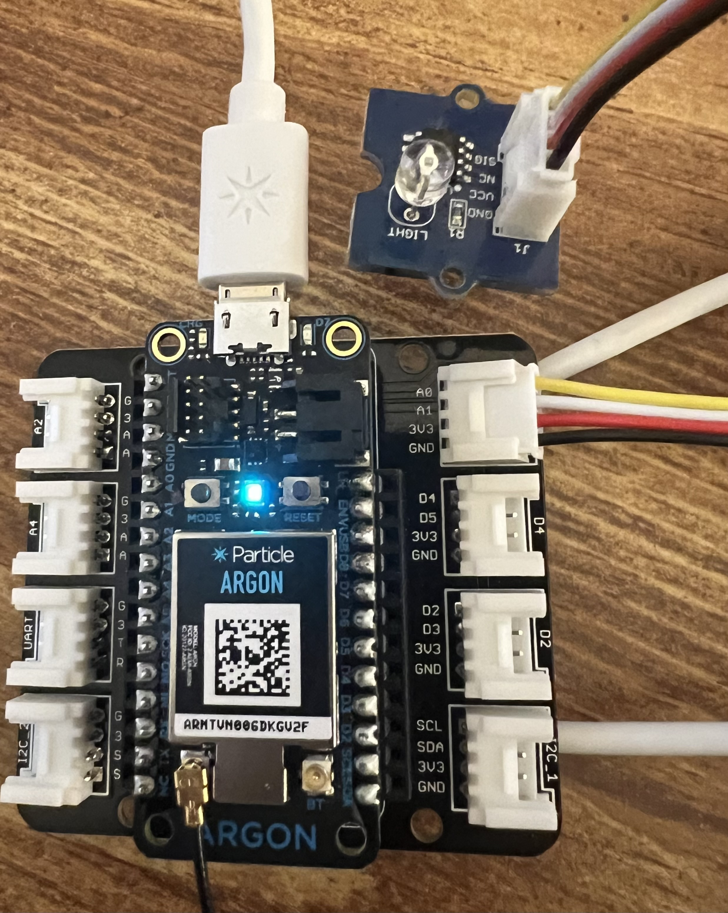
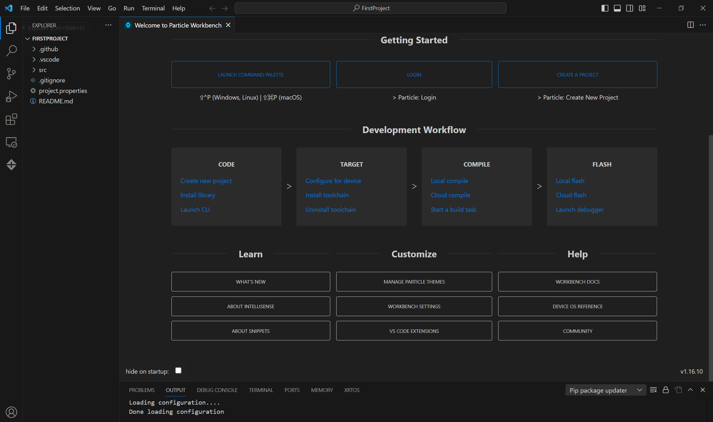

# Particle

The Particle Argon is a development kit with Wi-Fi and Bluetooth radios for building connected projects and products.

## Particle Setup:

https://docs.particle.io/quickstart/argon/

## Installing Particle Workbench:

https://docs.particle.io/quickstart/workbench/

## More Projects:

* https://docs.particle.io/quickstart/isk-project/#particle-variables-measure-temperature-amp-humidity
* https://docs.particle.io/quickstart/isk-project/#particle-functions-controlling-a-chainable-led
* https://docs.particle.io/quickstart/isk-project/#particle-publish-amp-subscribe-with-the-light-sensor
* https://docs.particle.io/quickstart/isk-project/#further-projects-and-resources
  
