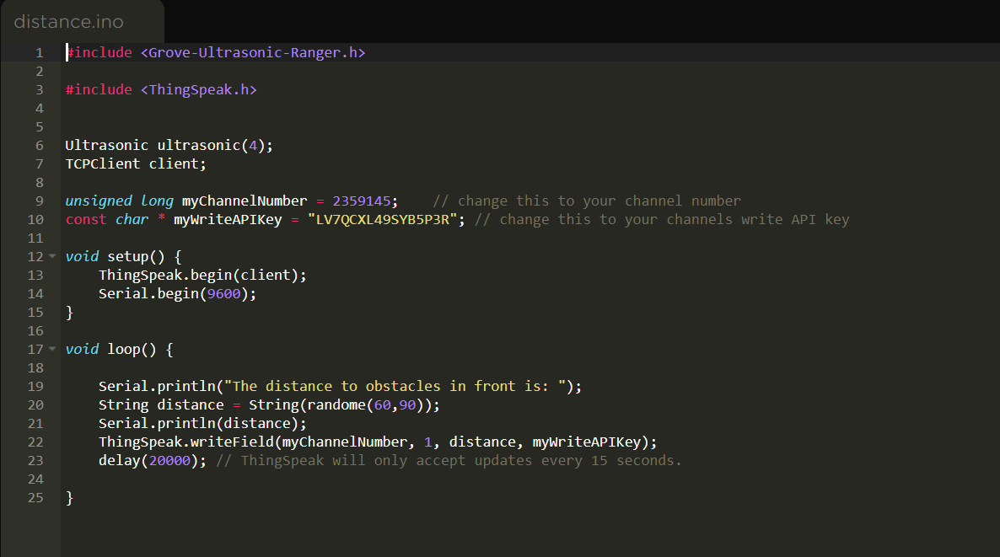
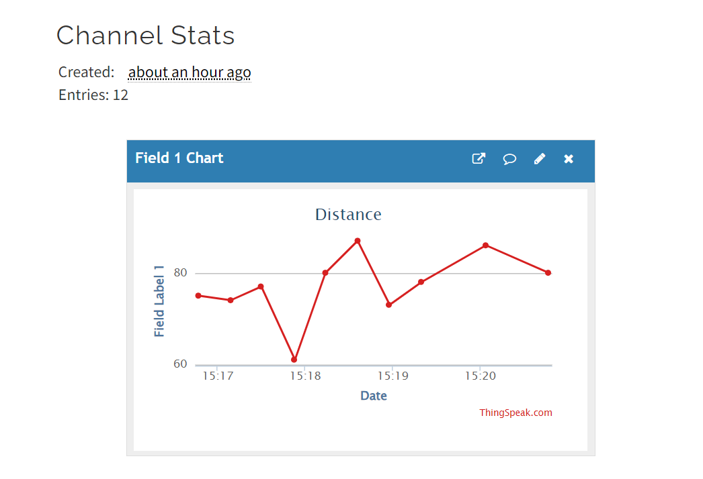

# Thingspeak - Distance

## Data Transfer Mechanisms

Typcially, there are 3 ways in which data can be sent using the [Particle Platform](https://particle.io).

* C Library which you add to your code and uses HTTP/HTTPS
* MQTT library which you again add to your code, but does it over the MQTT protocol
* Particle Webhooks

Each has their own advantange and disadvantage. 

In this project, random distance values are used to replicate a proximiate sensor and the data is transferred via the Thingspeak library.

## Main Project file:
distance.ino

## Script

## Output:

## Resource:
* [ThingSpeak Library](https://docs.particle.io/reference/device-os/libraries/t/ThingSpeak/)
